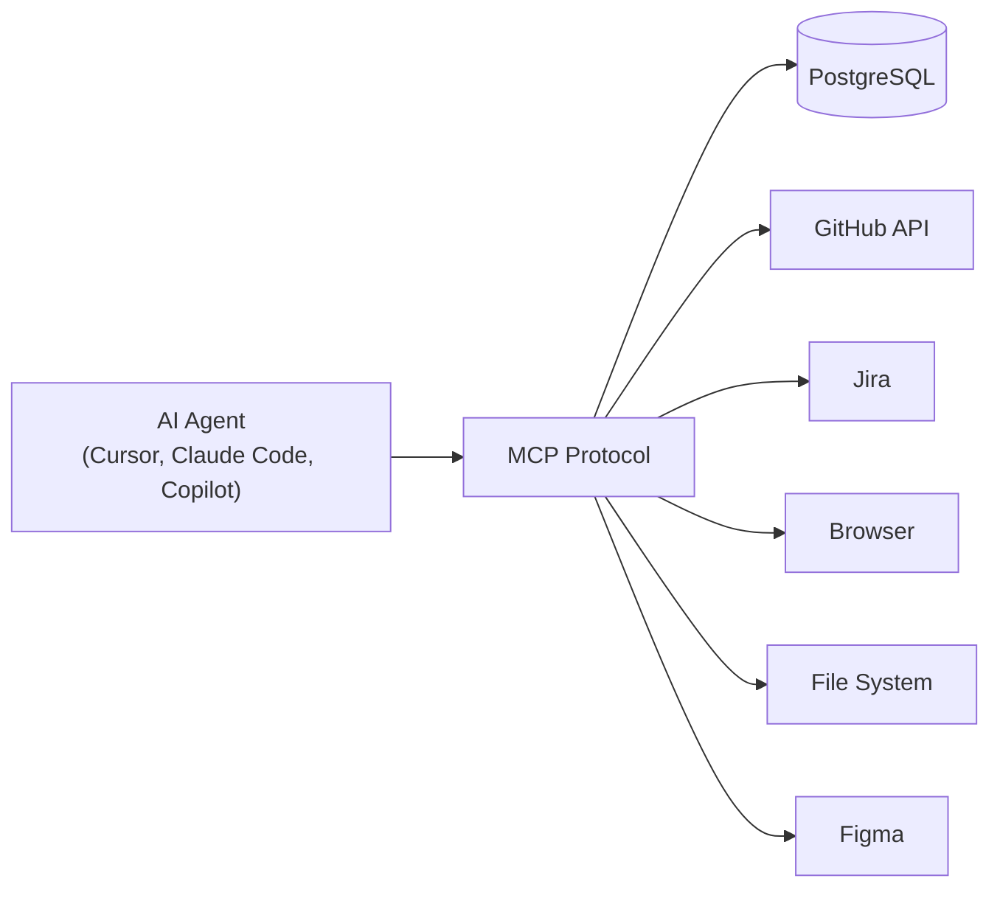
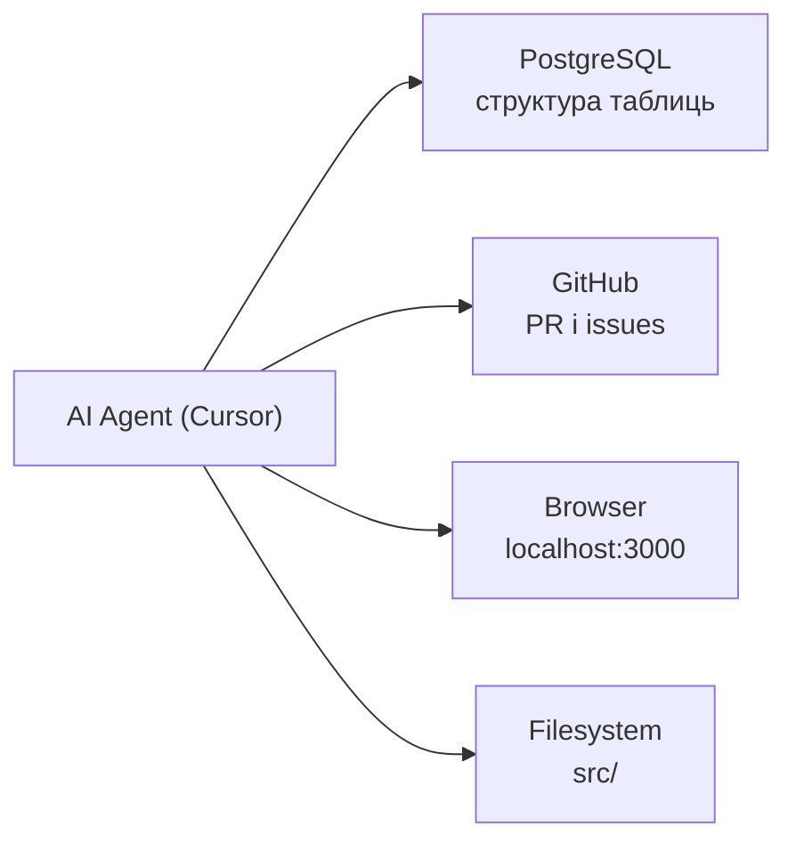
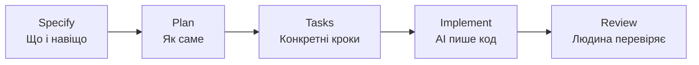

# AI & Development in 2026

Як AI-агенти змінюють розробку вже сьогодні

<div class="pt-12">
  <span class="px-2 py-1 rounded cursor-pointer" hover="bg-white bg-opacity-10">
    Вадим
  </span>
</div>

<div class="abs-br m-6 flex gap-2">
  <span class="text-sm opacity-50">Лютий 2026</span>
</div>

---
layout: center
class: text-center
---

# AI — це вже стандарт

<div class="grid grid-cols-3 gap-12 mt-12">
  <div>
    <div class="text-6xl font-bold text-blue-400">97%</div>
    <div class="mt-2 text-sm opacity-70">розробників використовують AI-інструменти</div>
    <div class="mt-1 text-xs opacity-40">GitHub Developer Survey 2025</div>
  </div>
  <div>
    <div class="text-6xl font-bold text-green-400">78%</div>
    <div class="mt-2 text-sm opacity-70">компаній інтегрували AI в розробку</div>
    <div class="mt-1 text-xs opacity-40">McKinsey Tech Report 2025</div>
  </div>
  <div>
    <div class="text-6xl font-bold text-purple-400">55%</div>
    <div class="mt-2 text-sm opacity-70">швидше виконуються типові задачі з AI</div>
    <div class="mt-1 text-xs opacity-40">Google Research 2025</div>
  </div>
</div>

<div class="mt-10 p-4 bg-white bg-opacity-5 rounded-xl max-w-md mx-auto border border-gray-500 border-opacity-20">
  <div class="flex items-center gap-2 text-xs opacity-50 mb-2">
    <span class="font-bold">@karpathy</span> · Jan 2023
  </div>
  <div class="text-base italic">"The hottest new programming language is English"</div>
  <a href="https://x.com/karpathy/status/1617979122625712128" class="text-xs opacity-30 mt-2 block">x.com/karpathy</a>
</div>

---
layout: section
---

# Еволюція: від ChatGPT до AI-агентів

Як ми дійшли до того, де ми зараз

---

# Хронологія AI в розробці

<div class="grid grid-cols-2 gap-x-8 gap-y-6 mt-8">

<div v-click>

### 2022 — ChatGPT
- "Розумний чат" для copy-paste коду
- Окреме вікно браузера
- Контекст = один промпт

</div>

<div v-click>

### 2023 — GitHub Copilot
- AI з'явився в IDE
- Автодоповнення + чат
- Контекст = поточний файл

</div>

<div v-click>

### 2024 — Cursor, Aider
- AI почав редагувати файли напряму
- Multi-file контекст
- Перші "агентні" можливості

</div>

<div v-click>

### 2025-2026 — Agentic AI
- AI як автономний виконавець задач
- Планує, виконує, тестує, виправляє
- Контекст = весь проект + інструменти

</div>

</div>

---
layout: center
---

# Vibe Coding

<div class="mt-6 p-5 bg-white bg-opacity-5 rounded-xl max-w-xl mx-auto border border-gray-500 border-opacity-20">
  <div class="flex items-center gap-2 text-sm opacity-50 mb-3">
    <span class="font-bold">@karpathy</span> · Feb 2025
  </div>
  <div class="text-lg leading-relaxed">There's a new kind of coding I call <span class="text-purple-400 font-bold">"vibe coding"</span>, where you fully give in to the vibes, embrace exponentials, and forget that the code even exists.</div>
  <a href="https://x.com/karpathy/status/1886192184808149383" class="text-xs opacity-30 mt-3 block">x.com/karpathy</a>
</div>

<div class="mt-6 text-sm opacity-60 text-center">

Слово року за версією Collins Dictionary 2025

</div>

---
layout: center
class: text-center
---

# Vibe Coding на практиці


<div class="mt-4 text-center">
<div class="text-lg"><span class="text-red-400 font-bold">AI Slop</span> — код/контент що виглядає правильно, але є generic сміттям</div>
<div class="text-sm opacity-50 mt-1">Неіснуючі API, вигадані бібліотеки, "працює але не так", hallucinations</div>
</div>

---
layout: center
---

# Agentic Engineering

<div class="mt-6 p-5 bg-white bg-opacity-5 rounded-xl max-w-xl mx-auto border border-gray-500 border-opacity-20">
  <div class="flex items-center gap-2 text-sm opacity-50 mb-3">
    <span class="font-bold">@karpathy</span> · Feb 2026
  </div>
  <div class="text-lg leading-relaxed">One year ago I mass-coined "vibe coding". Today I'd like to mass-coin <span class="text-blue-400 font-bold">"agentic engineering"</span> — there is an art & science and expertise to it.</div>
  <a href="https://x.com/karpathy/status/2019137879310836075" class="text-xs opacity-30 mt-3 block">x.com/karpathy</a>
</div>

<div class="grid grid-cols-2 gap-12 mt-8 text-center">
  <div>
    <div class="text-xl font-bold opacity-40 line-through">Vibe Coding</div>
    <div class="mt-2 text-sm opacity-40">Промпт → код → "якось працює"</div>
  </div>
  <div>
    <div class="text-xl font-bold text-blue-400">Agentic Engineering</div>
    <div class="mt-2 text-sm opacity-70">Контекст → агент → review → результат</div>
  </div>
</div>

---

# Human in the Loop

<div class="mt-8">

**Визначення:** Людина залишається в циклі прийняття рішень, навіть коли AI виконує роботу автономно.

</div>

<div class="grid grid-cols-2 gap-12 mt-8">

<div>

### Як це працює

<v-clicks>

- Ви ставите задачу агенту
- Агент планує і виконує кроки
- Ви переглядаєте результат
- Приймаєте, відхиляєте або коригуєте
- Агент продовжує з вашим фідбеком

</v-clicks>

</div>

<div>

### Аналогія

<div class="mt-4 p-4 bg-blue-500 bg-opacity-10 rounded-lg">

**AI = стажер з ідеальною пам'яттю**

- Знає всі мови, фреймворки, паттерни
- Працює дуже швидко
- Але не має досвіду вашого проекту
- Потребує наставника (вас!)
- Може зробити щось "технічно правильно, але не так як треба"

</div>

</div>

</div>

---
layout: section
---

# Context Engineering

<div class="grid grid-cols-2 gap-6 mt-6">

<div class="p-4 bg-white bg-opacity-5 rounded-xl border border-gray-500 border-opacity-20">
  <div class="flex items-center gap-2 text-xs opacity-50 mb-2">
    <span class="font-bold">@karpathy</span> · 2025
  </div>
  <div class="text-sm">I think the word "prompt engineering" is grossly over-indexed. The real skill is <span class="text-blue-400 font-bold">context engineering</span> — the art of filling the context window with just the right information for the next step.</div>
  <a href="https://x.com/karpathy/status/1886192184808149383" class="text-xs opacity-30 mt-2 block">x.com/karpathy</a>
</div>

<div class="p-4 bg-white bg-opacity-5 rounded-xl border border-gray-500 border-opacity-20">
  <div class="flex items-center gap-2 text-xs opacity-50 mb-2">
    <span class="font-bold">Anthropic Engineering Blog</span> · Sep 2025
  </div>
  <div class="text-sm font-bold mb-2">"Effective context engineering for AI agents"</div>
  <div class="text-xs opacity-60">Context is a critical but finite resource for AI agents. Building with LLMs is becoming less about finding the right words and more about: <span class="italic">"what configuration of context is most likely to generate the desired behavior?"</span></div>
  <a href="https://www.anthropic.com/engineering/effective-context-engineering-for-ai-agents" class="text-xs opacity-30 mt-2 block">anthropic.com/engineering</a>
</div>

</div>

---

# Prompt Engineering vs Context Engineering

<div class="grid grid-cols-2 gap-12 mt-8">

<div>

### Prompt Engineering (2023)

<v-clicks>

- Фокус на формулюванні запиту
- "Як правильно попросити AI"
- Один промпт → одна відповідь
- Трюки: "Think step by step", "Act as expert"

</v-clicks>

</div>

<div>

### Context Engineering (2025-2026)

<v-clicks>

- Фокус на всьому, що AI "бачить"
- "Як правильно налаштувати середовище AI"
- Системний промпт + правила + файли + історія
- Структура проекту, конвенції, приклади

</v-clicks>

</div>

</div>

---

# Що входить в контекст AI-агента

<div class="grid grid-cols-2 gap-8 mt-4">

<div>

<v-clicks>

- **System Prompt** — базові інструкції
- **Rules & Instructions** — правила проекту
- **Файли проекту** — код, конфіги
- **Історія діалогу** — попередні повідомлення
- **MCP Tools** — доступні інструменти
- **Memory / Notes** — нотатки між сесіями

</v-clicks>

</div>

<div class="flex items-center justify-center">
<div class="text-center">
  <div class="text-3xl font-mono font-bold text-blue-400">Якість =<br/>Модель × Контекст</div>
  <div class="text-sm opacity-50 mt-3">Навіть найкраща модель дасть поганий результат з поганим контекстом</div>
</div>
</div>

</div>

---

# Context Engineering: дві крайнощі

<div class="grid grid-cols-2 gap-8 mt-8">

<div class="p-4 bg-red-500 bg-opacity-10 rounded-lg">

### Замало контексту

```
Напиши API endpoint для створення юзера
```

<v-clicks>

- AI вигадує архітектуру сам
- Generic код, не для вашого проекту
- Доведеться переписувати

</v-clicks>

</div>

<div class="p-4 bg-red-500 bg-opacity-10 rounded-lg">

### Забагато контексту

```
Ось весь проект, всі файли, вся
документація, всі тести...
Зроби endpoint.
```

<v-clicks>

- Context rot — модель "губиться"
- Agent drift — робить не те
- Дорого (токени = гроші)

</v-clicks>

</div>

</div>

---

# Agent Drift

**Визначення:** Поступове відхилення AI-агента від поставленої задачі.

<div class="grid grid-cols-2 gap-8 mt-4">

<div>

### Математика drift

<div class="mt-4 p-4 bg-red-500 bg-opacity-10 rounded-lg font-mono text-center">
  <div class="text-sm opacity-60 mb-2">Якщо кожен крок вірний на 99%:</div>
  <div class="text-xl"><code>pow(0.99, 100) = 0.366</code></div>
  <div class="text-sm opacity-60 mt-2">100 кроків → <span class="text-red-400 font-bold">лише 37% шанс</span> що все правильно</div>
</div>

<div class="mt-3 text-xs opacity-50">

| Кроків | pow(0.99, n) | Результат |
|---|---|---|
| 10 | 0.904 | Ще ок |
| 50 | 0.605 | Підкидаєш монетку |
| 100 | 0.366 | Скоріш за все зламано |

</div>

</div>

<div>

### Як боротися

<v-clicks>

- Розбивати задачі на менші частини
- Чіткі правила та обмеження (Rules)
- Review проміжних результатів
- Нова сесія для нової задачі
- Git — завжди можна відкатити

</v-clicks>

<div v-click class="mt-3 p-2 bg-yellow-500 bg-opacity-10 rounded-lg text-xs">

💡 "Попросив додати кнопку — агент відрефакторив пів проекту і переписав роутинг"

</div>

</div>

</div>

---

# Рішення: правильний контекст

<div class="grid grid-cols-2 gap-8 mt-6">

<div class="p-4 bg-green-500 bg-opacity-10 rounded-lg">

### Приклад правильного контексту

```
Endpoint для створення юзера.
Стек: Symfony 7, API Platform.
Приклад: src/Entity/Product.php
Валідація: Assert атрибути.
Тести: tests/Api/
```

<v-clicks>

- Мінімум потрібної інформації
- Конкретні приклади з проекту
- Чіткі обмеження і конвенції

</v-clicks>

</div>

<div>

### Як цього досягти

<v-clicks>

- **Rules файли** — автоматично додають контекст
- **Memory Bank** — AI знає проект між сесіями
- **Короткі сесії** — менше drift
- **MCP** — AI сам бере потрібне з БД, GitHub
- **SDD** — spec як джерело правди

</v-clicks>

<div v-click class="mt-4 p-3 bg-blue-500 bg-opacity-10 rounded-lg text-xs">

Anthropic: "Find the <span class="text-blue-400 font-bold">smallest possible set</span> of high-signal tokens that maximize the desired outcome"

</div>

</div>

</div>

---
layout: section
---

# Рейтинги та бенчмарки моделей

Як обрати правильну модель для задачі

---

# Де дивитися рейтинги

<div class="grid grid-cols-2 gap-12 mt-8">

<div>

### LMArena (arena.ai)

<v-clicks>

- "Сліпе" порівняння моделей людьми
- ELO-рейтинг (як у шахах)
- Людина бачить 2 відповіді — обирає кращу
- Не знаючи яка модель яка
- Найоб'єктивніший рейтинг

</v-clicks>

<!-- Тут можна вставити скріншот arena.ai -->

</div>

<div>

### SWE-bench

<v-clicks>

- Бенчмарк спеціально для коду
- Реальні GitHub issues як завдання
- Агент має знайти баг і зафіксити
- Вимірює end-to-end здатність
- Найрелевантніший для розробників

</v-clicks>

<!-- Тут можна вставити скріншот swebench.com -->

</div>

</div>

<div class="mt-6 text-sm opacity-60 text-center">

Також: Aider Polyglot Leaderboard, HumanEval, MMLU, LiveCodeBench

</div>

---
layout: center
class: text-center
---

# Які бувають агенти для розробки?


---

# Огляд типів агентів

<div class="grid grid-cols-2 gap-6 mt-4 text-sm">

<div>

### 🖥️ IDE-агенти (Human in the Loop)

- **Cursor** ($20/міс) — форк VS Code, agent mode, MCP
- **GitHub Copilot** ($10-19) — autocomplete + chat + agent
- **Windsurf** ($0-15) — Cascade, безкоштовний tier
- **JetBrains AI** — для PhpStorm фанів

**Коли:** Щоденна розробка, ви контролюєте кожен крок

</div>

<div>

### 💻 CLI-агенти (Terminal)

- **Claude Code** — найпотужніший, PR + коміти
- **Aider** — open source, будь-яка модель
- **Gemini CLI** — безкоштовний, 1M контекст

**Коли:** CI/CD, batch-операції, автоматизація

</div>

<div>

### 🎨 Спеціалізовані

- **v0.dev** ($20) — UI-компоненти (React/Tailwind)
- **Bolt.new / Lovable** — повні аплікації з промпту
- **Figma AI** — генерація дизайну

**Коли:** Прототипи, UI mockups, швидкий MVP

</div>

<div>

### 🤖 Автономні / Cloud

- **Devin** (~$500) — "AI software engineer"
- **Copilot Workspace** — від issue до PR в GitHub
- **Background Agents** (Cursor) — працюють паралельно

**Коли:** Довгі задачі, паралельна робота, потребують нагляду

</div>

</div>
---
layout: section
---

# Інфраструктура AI-агентів

MCP, Rules, Memory Bank

---

# MCP — Model Context Protocol

**"USB для AI"** — єдиний стандарт підключення інструментів до AI-агентів



<div class="mt-4 text-sm opacity-70">

- Стандартний протокол від Anthropic — як HTTP для вебу, тільки для AI
- Один MCP-сервер працює з **будь-яким** агентом
- Open source, підтримується всіма великими гравцями

</div>

---

# MCP — як це працює

<div class="grid grid-cols-2 gap-12 mt-8">

<div>

### Що дає MCP

<v-clicks>

- AI-агент отримує "руки" — може взаємодіяти зі світом
- Стандартний протокол (як HTTP для вебу)
- Створений Anthropic, підтримується всіма
- Один MCP-сервер працює з будь-яким агентом
- Open source

</v-clicks>

</div>

<div>

### Приклади MCP-серверів

<v-clicks>

- **PostgreSQL** — AI читає/пише в БД
- **GitHub** — створює PR, читає issues
- **Jira** — працює з тікетами
- **Browser** — відкриває сторінки, тестує UI
- **Figma** — читає дизайн, генерує код
- **Filesystem** — працює з файлами
- **Slack** — читає/пише повідомлення

</v-clicks>

</div>

</div>

---

# MCP для нашого стеку

### Приклад: Symfony + React проект



<div v-click class="mt-4 p-3 bg-green-500 bg-opacity-10 rounded-lg text-sm">

💡 AI-агент може: прочитати JIRA-тікет → подивитися структуру БД → написати Entity + Migration + API endpoint + React-компонент → створити PR

</div>

---
layout: section
---

# Rules & Instructions

Як керувати поведінкою AI-агента

---

# Ієрархія конфігурації агента

<div class="mt-6">

| Файл | Інструмент | Для чого |
|---|---|---|
| `.cursorrules` | Cursor | Загальні правила для всього проекту |
| `.cursor/rules/*.md` | Cursor | Правила для конкретних файлів/паттернів |
| `AGENTS.md` | GitHub Copilot, Codex | Інструкції для агента (аналог .cursorrules) |
| `CLAUDE.md` | Claude Code | Інструкції для Claude в терміналі |
| `llms.txt` | Будь-який AI | Публічний опис проекту для AI (як robots.txt) |

</div>

<div v-click class="mt-6 p-3 bg-yellow-500 bg-opacity-10 rounded-lg text-sm">

💡 Тренд 2026: кожен проект має файл інструкцій для AI, як раніше мав README.md

</div>

---

# Cursor: Commands, Rules, Skills

<div class="grid grid-cols-3 gap-8 mt-8">

<div>

### Rules

<v-clicks>

- Автоматично застосовуються
- Завжди в контексті агента
- Конвенції коду
- Структура проекту
- "Завжди пиши тести"
- "Використовуй TypeScript strict"

</v-clicks>

</div>

<div>

### Commands

<v-clicks>

- Викликаються вручну через `/`
- Шаблони для типових задач
- `/create-component`
- `/fix-bug`
- `/write-tests`
- Можна параметризувати

</v-clicks>

</div>

<div>

### Skills

<v-clicks>

- Комплексні інструкції
- Для складних сценаріїв
- Включають кілька кроків
- Можуть використовувати tools
- Deploy pipeline
- Migration workflow

</v-clicks>

</div>

</div>

---

# Приклад: як правило змінює поведінку

<div class="grid grid-cols-2 gap-8 mt-4">

<div class="p-3 bg-red-500 bg-opacity-10 rounded-lg">

### Без правил

Prompt: *"Додай ендпоінт для видалення юзера"*

```php
public function delete(int $id): Response {
    $user = $this->repo->find($id);
    $this->em->remove($user);
    $this->em->flush();
    return new Response('', 204);
}
```

<div class="text-xs opacity-60">Простий контролер без валідації, прав, логування</div>

</div>

<div class="p-3 bg-green-500 bg-opacity-10 rounded-lg">

### З правилами

```yaml
# .cursor/rules/symfony.md
- API Platform для ендпоінтів
- Soft delete через Gedmo
- Перевіряй права через Voter
- Логуй операції видалення
```

<div class="text-sm mt-2">Результат: повний код з Voter, soft-delete, логуванням, тестом</div>

</div>

</div>

---

# Memory Bank

<div class="mt-6">

### Проблема: AI не пам'ятає між сесіями

</div>

<div class="grid grid-cols-2 gap-12 mt-6">

<div>

### Без Memory Bank

<v-clicks>

- Кожна нова сесія — "чистий аркуш"
- AI перепитує те саме
- Забуває архітектурні рішення
- Не знає що вже зроблено
- Повторює помилки

</v-clicks>

</div>

<div>

### З Memory Bank

<v-clicks>

- Структуровані файли з контекстом
- AI "пам'ятає" проект між сесіями
- Знає архітектуру та рішення
- Бачить прогрес
- Вчиться на помилках

</v-clicks>

</div>

</div>

---

# Memory Bank: структура

<div class="mt-6">

```
memory-bank/
├── projectbrief.md      # Опис проекту, цілі, вимоги
├── techContext.md        # Стек, залежності, інфраструктура
├── systemPatterns.md     # Архітектурні рішення, паттерни
├── activeContext.md      # Над чим працюємо зараз
├── progress.md           # Що зроблено, що залишилось
└── errors.md             # Типові помилки та їх рішення
```

</div>

<div class="grid grid-cols-2 gap-8 mt-6">

<div v-click>

### Альтернативи

- **Cursor Notepad** — нотатки в IDE
- **`.context/`** папка в проекті
- **Custom Instructions** в ChatGPT/Claude
- **Pinned messages** в чаті агента

</div>

<div v-click>

### Найкращі практики

- Оновлюйте після кожної значної зміни
- Нехай AI сам оновлює свою пам'ять
- Зберігайте в git разом з проектом
- Використовуйте як onboarding для нових розробників

</div>

</div>

---
layout: section
---

# Скільки це коштує?

Ціни, підписки та ROI

---

# Порівняння цін: підписки

<div class="mt-6">

| Інструмент | Ціна/міс | Що отримуєте |
|---|---|---|
| **Cursor Pro** | $20 | IDE + Agent mode + MCP + Background Agents |
| **GitHub Copilot Individual** | $10 | Autocomplete + Chat + Agent mode |
| **GitHub Copilot Business** | $19 | + Admin controls, policy management |
| **Windsurf** | $0-15 | IDE + Cascade agent (є free tier) |
| **Claude Pro** | $20 | Chat + Artifacts + Projects |
| **ChatGPT Plus** | $20 | Chat + Canvas + GPTs |
| **v0.dev** | $20 | UI generation (React + Tailwind) |
| **Devin** | ~$500 | Автономний AI-інженер |

</div>

---

# Порівняння цін: API (pay-per-use)

<div class="mt-4">

Для консольних агентів і автоматизації — платите за токени.

</div>

<div class="mt-6">

| Модель | Input (1M токенів) | Output (1M токенів) | Контекст |
|---|---|---|---|
| Claude 4 Sonnet | $3 | $15 | 200K |
| Claude 4 Opus | $15 | $75 | 200K |
| Claude 4 Haiku | $0.80 | $4 | 200K |
| GPT-4o | $2.50 | $10 | 128K |
| GPT-4o mini | $0.15 | $0.60 | 128K |
| Gemini 2.5 Pro | $1.25 | $10 | 1M+ |
| Gemini 2.5 Flash | $0.15 | $0.60 | 1M+ |

</div>

<div v-click class="mt-4 text-sm opacity-60">

1M токенів ~ 750K слів ~ 3000 сторінок тексту. Типовий робочий день з агентом: 0.5-3M токенів.

</div>

---

# Реальна вартість на практиці

<div class="grid grid-cols-2 gap-12 mt-8">

<div>

### Типовий розробник на місяць

<v-clicks>

- Cursor Pro: **$20**
- Claude Pro (для складних задач): **$20**
- API витрати (Claude Code): **$10-30**
- **Разом: ~$50-70/міс**

</v-clicks>

</div>

<div>

### ROI

<v-clicks>

- Економія: **2-4 години/день** на типових задачах
- Бойлерплейт, тести, документація
- Code review, рефакторинг
- Якщо годинна ставка $30-50
- Економія: **$1200-4000/міс**
- ROI: **~20-60x** 🚀

</v-clicks>

</div>

</div>

<div v-click class="mt-6 p-3 bg-green-500 bg-opacity-10 rounded-lg text-sm">

💡 Для аутсорс-компанії: AI не скорочує людей — AI дозволяє робити більше за той самий час. Клієнт отримує більше value.

</div>

---

# AI для тестувальників

<div class="mt-6">

AI — це не тільки для розробників. QA отримує потужні інструменти.

</div>

<div class="grid grid-cols-2 gap-8 mt-6">

<div>

### Генерація тестів

<v-clicks>

- **Unit-тести** — AI аналізує код і генерує тести
- **E2E тести** — Playwright/Cypress з промпту
- **Тест-кейси** — з вимог або user stories
- **Edge cases** — AI знаходить крайні випадки, про які ви не подумали

</v-clicks>

</div>

<div>

### Аналіз та автоматизація

<v-clicks>

- **Аналіз багів** — вставте стектрейс → отримайте причину
- **Регресійне тестування** — AI визначає що тестувати після змін
- **API тестування** — генерація Postman/REST-колекцій
- **Тестова документація** — з коду в тест-плани

</v-clicks>

</div>

</div>

<div v-click class="mt-6 p-3 bg-blue-500 bg-opacity-10 rounded-lg text-sm">

Інструменти: Cursor для написання тестів, ChatGPT/Claude для тест-планів, Playwright + AI для E2E

</div>

---

# Безпека та конфіденційність

<div class="mt-4">

Критично важливо для аутсорс-компанії!

</div>

<div class="grid grid-cols-2 gap-8 mt-6">

<div>

### Що МОЖНА відправляти в AI

<v-clicks>

- Публічний код (open source залежності)
- Загальні архітектурні питання
- Генерація бойлерплейту
- Код, якщо дозволяє NDA/контракт
- Дані на дев-середовищі (не прод!)

</v-clicks>

</div>

<div>

### Що НЕ МОЖНА

<v-clicks>

- Credentials, API keys, паролі
- Персональні дані клієнтів (GDPR!)
- Production дані
- Код, якщо контракт забороняє
- Внутрішні документи клієнта

</v-clicks>

</div>

</div>

<div v-click class="mt-6 p-3 bg-red-500 bg-opacity-10 rounded-lg text-sm">

⚠️ Завжди перевіряйте з менеджментом/клієнтом: чи дозволено використовувати AI на проекті. Деякі клієнти мають strict AI policies.

</div>

---

# Best Practices для команди

<div class="grid grid-cols-2 gap-x-8 gap-y-4 mt-6">

<v-clicks>

<div>

**1. Завжди review AI-коду** — AI = джуніор. Перевіряйте перед мержем.

</div>

<div>

**2. Rules/Instructions в проекті** — один раз налаштувати, якісний код щоразу.

</div>

<div>

**3. Менші задачі** — "Зроби все" → drift. "Зроби Entity User" → результат.

</div>

<div>

**4. Git — комітьте часто** — AI зламав? Відкат за секунду.

</div>

<div>

**5. Безпека** — ніколи credentials в AI. Ревʼюїте SQL та авторизацію.

</div>

<div>

**6. Діліться в команді** — хороший промпт/правило → поширте на всіх.

</div>

</v-clicks>

</div>

---
layout: center
---

# Що почати використовувати завтра?

<div class="mt-8 text-left">

<v-clicks>

<div class="p-3 my-3 bg-blue-500 bg-opacity-10 rounded-lg">

**Крок 1:** Встановити Cursor або GitHub Copilot (10 хвилин)

</div>

<div class="p-3 my-3 bg-green-500 bg-opacity-10 rounded-lg">

**Крок 2:** Створити `.cursorrules` або `AGENTS.md` для вашого проекту (30 хвилин)

</div>

<div class="p-3 my-3 bg-purple-500 bg-opacity-10 rounded-lg">

**Крок 3:** Спробувати Agent mode для рутинної задачі (1 година)

</div>

<div class="p-3 my-3 bg-yellow-500 bg-opacity-10 rounded-lg">

**Крок 4:** Поділитися досвідом з командою та створити спільні правила

</div>

</v-clicks>

</div>

---
layout: section
---

# Цікавий тренд: Spec-Driven Development

Альтернативний підхід до роботи з AI

---

# Spec-Driven Development (SDD)

<div class="mt-4">

**Проблема "Vibe Coding":** промпт → код → не те → ще промпт → хаос. Немає вимог, немає плану, немає контролю.

</div>

<div class="mt-6">

**SDD — протилежний підхід:**

</div>

<div class="mt-4">



</div>

<div class="grid grid-cols-2 gap-8 mt-6">

<div v-click>

### Переваги

- Людина контролює **що** будується
- AI ефективніше реалізує **як**
- Документація створюється автоматично
- Менше agent drift
- Легше review і onboarding

</div>

<div v-click>

### Артефакти SDD

- `requirements.md` — що робимо і навіщо
- `design.md` — архітектура і рішення
- `tasks.md` — конкретні кроки з acceptance criteria
- Все в git, все ревʼюється командою

</div>

</div>

---

# SDD: інструменти

<div class="grid grid-cols-3 gap-6 mt-8">

<div>

### Kiro (Amazon)

<v-clicks>

- AI IDE на базі VS Code
- SDD як core-фічa
- Генерує specs автоматично з промпту
- **Agent Hooks** — тригери на зміни файлів
- EARS-нотація для вимог
- MCP підтримка
- **Безкоштовний preview**

</v-clicks>

</div>

<div>

### GitHub Spec Kit

<v-clicks>

- Open source тулкіт
- 4 фази: Specify → Plan → Tasks → Implement
- **Agent-agnostic** — працює з Cursor, Claude Code, Copilot
- CLI для ініціалізації
- Контрольні точки для review
- Ідеальний для існуючих проектів

</v-clicks>

</div>

<div>

### OpenSpec

<v-clicks>

- Open source фреймворк
- 23k+ GitHub stars
- Markdown-based специфікації
- Propose → Apply → Archive
- Підтримує 20+ AI-інструментів
- Фокус на brownfield development

</v-clicks>

</div>

</div>

<div v-click class="mt-6 p-3 bg-blue-500 bg-opacity-10 rounded-lg text-sm">

💡 SDD не замінює Agile. Це доповнення: замість того щоб AI "вгадував" що ви хочете — ви описуєте це в spec, а AI реалізує точно за планом.

</div>

---

# SDD: Vibe Coding vs Spec-Driven

<div class="grid grid-cols-2 gap-12 mt-8">

<div class="p-4 bg-red-500 bg-opacity-10 rounded-lg">

### Vibe Coding

```
"Зроби мені todo-app з авторизацією"
```

<v-clicks>

- AI сам вирішує архітектуру
- Немає вимог — немає контролю
- Кожна сесія починається з нуля
- Agent drift через 30 хвилин
- Результат: "працює, але не те що треба"

</v-clicks>

</div>

<div class="p-4 bg-green-500 bg-opacity-10 rounded-lg">

### Spec-Driven

```
spec/ → requirements.md → design.md → tasks.md
```

<v-clicks>

- Архітектура задокументована до коду
- Чіткі acceptance criteria
- AI слідує плану між сесіями
- Review на кожному етапі
- Результат: "саме те що описали в spec"

</v-clicks>

</div>

</div>

<div v-click class="mt-6 text-center text-sm opacity-60">

Тренд: великі команди вже переходять на SDD. Це як TDD, тільки для AI-розробки.

</div>

---

# Корисні посилання

<div class="grid grid-cols-2 gap-8 mt-8">

<div>

### Інструменти

- [cursor.com](https://cursor.com) — AI IDE
- [github.com/features/copilot](https://github.com/features/copilot) — Copilot
- [claude.ai](https://claude.ai) — Claude
- [v0.dev](https://v0.dev) — UI Generation
- [bolt.new](https://bolt.new) — Full-stack AI

</div>

<div>

### Рейтинги та ресурси

- [lmarena.ai](https://lmarena.ai) — LM Arena
- [swebench.com](https://swebench.com) — SWE-bench
- [aider.chat](https://aider.chat) — Aider + Leaderboard
- [modelcontextprotocol.io](https://modelcontextprotocol.io) — MCP
- [docs.cursor.com](https://docs.cursor.com) — Cursor Docs

</div>

</div>

---
layout: center
class: text-center
---

# Дякую! Питання?

<div class="mt-8">

<div class="text-xl opacity-70 mb-8">
AI не замінює розробників.<br/>
Розробники з AI замінюють розробників без AI.
</div>

</div>

<div class="mt-4 text-sm opacity-40">
  Вадим | Лютий 2026
</div>

